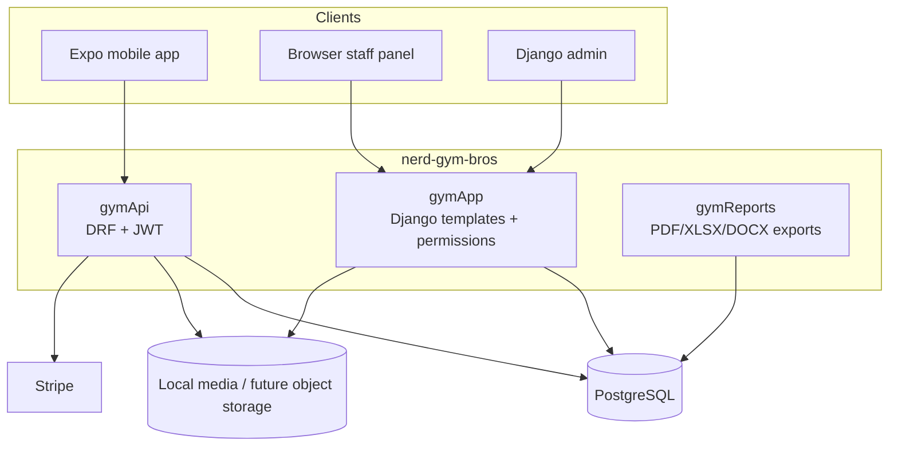
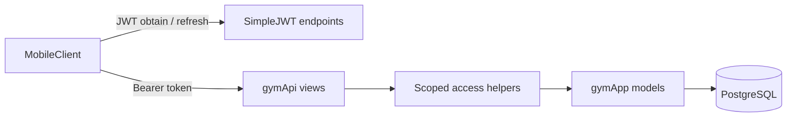
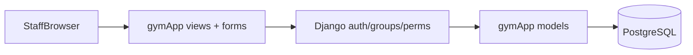

# Architecture

`nerd-gym-bros` is the backend and staff/admin application for the engineering thesis project **Integrated Gym Training Management System**. It works alongside the separate mobile repository `nerd-gym-bros-mobile`.

## System Context

## Django App Split

- `gymApp`
  Core domain models, Django template-based staff panel, forms, permissions, fixtures, signals.
- `gymApi`
  Mobile-facing REST API with JWT authentication, throttling, paginated lists, and schema generation.
- `gymReports`
  Export/report generation for DOCX, PDF, and XLSX outputs.

## Request Flows

### Mobile API

### Staff/Admin Panel

## API Structure

The API views are grouped by domain in `gymProj/gymApi/views/`:

- `auth.py` - health, register, verify, resend verification, client detail
- `exercises.py` - exercise list/detail
- `workouts.py` - workout plans, workout runs, workout logs
- `subscriptions.py` - subscription plans, Stripe sheet creation, webhook, cancel flow
- `feedback.py` - bug reports and feature requests
- `gyms.py` - gyms list
- `dictionaries.py` - equipment list
- `mobile_content.py` - public mobile CMS copy

`gymApi/views/__init__.py` re-exports the public view surface so URL configuration can stay stable while the implementation remains modular.

## Security and Access

- JWT authentication via `djangorestframework-simplejwt`
- DRF throttling for login/register/token refresh
- Object scoping helpers in `gymApi/access.py` for exercise and workout log access
- Public mobile CMS copy is intentionally read-only and anonymous
- Production settings enforce `SECRET_KEY`, `ALLOWED_HOSTS`, `CORS_ALLOWED_ORIGINS`, secure cookies, and HSTS

## Development Tooling

- Dependency management: `uv`
- Lint / format: `ruff`, `pre-commit`
- Tests: `pytest`, `pytest-django`
- CI: GitHub Actions
- API schema: `drf-spectacular`

## Documentation Entry Points

- OpenAPI schema: `/api/schema/`
- Swagger UI: `/api/docs/`
- Project README: `README.md`
